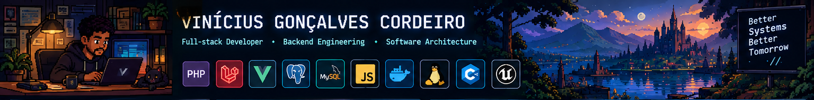
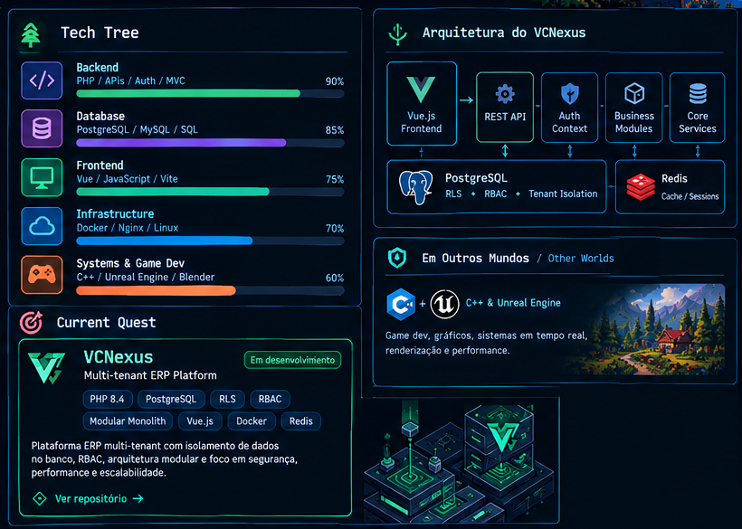
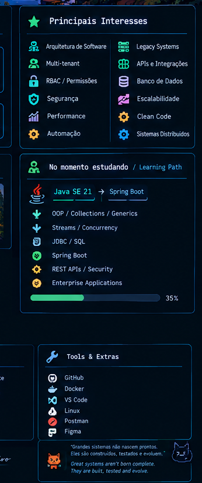

<div align="center">

# Vinícius Gonçalves Cordeiro

### `Full-stack Developer` · `Backend Engineering` · `Software Architecture`

**Código + Arquitetura + Aprendizado = Evolução**  
**Code + Architecture + Learning = Progress**

[](https://github.com/vinicius-g-cordeiro)
[](https://linkedin.com/in/vinicordeirox)
[](#)

</div>

<p align="center">
  
</p>

---

## `> system.boot()`

```text
[ OK ] Backend systems
[ OK ] Database architecture
[ OK ] APIs & integrations
[ OK ] Security & authorization
[ OK ] Legacy modernization
[ OK ] Continuous learning

STATUS: BUILDING
```

## 🇧🇷 Sobre mim

Sou desenvolvedor **full-stack**, com foco maior em **backend, bancos de dados e arquitetura de software**.

Gosto de trabalhar em problemas reais: sistemas de gestão, APIs, integrações, aplicações legadas, automação, controle de acesso e aplicações multi-tenant.

Meu interesse não está apenas em fazer o código funcionar, mas em entender **como os dados, regras, segurança e componentes do sistema se relacionam** — e construir algo que continue sendo mantível conforme o projeto cresce.

Também exploro **C++ e Unreal Engine**, além de estar expandindo meu conhecimento no ecossistema **Java + Spring Boot**.

## 🇺🇸 About me

I'm a **full-stack developer** with a stronger focus on **backend engineering, databases and software architecture**.

I enjoy solving real-world problems involving management systems, APIs, integrations, legacy applications, automation, authorization and multi-tenant platforms.

My goal is not simply to make software work, but to understand how **data, business rules, security and system boundaries interact** and build solutions that remain maintainable as they evolve.

I also explore **C++ and Unreal Engine**, while expanding my knowledge of the **Java + Spring Boot** ecosystem.

---

# 🎮 TECH TREE

| Area | Technologies |
|---|---|
| **Backend** | PHP 8.x · Laravel · REST APIs · MVC · OOP · Authentication · RBAC |
| **Frontend** | JavaScript · Vue.js · Vite · HTML · CSS · Tailwind CSS |
| **Databases** | PostgreSQL · MySQL · SQL Server · SQL · Redis |
| **Infrastructure** | Docker · Nginx · Linux · Git |
| **Systems / Game Dev** | C++ · Unreal Engine · Blender |
| **Currently expanding** | Java SE 21 · Spring Boot · JDBC · Java REST APIs |

### Skill Tree

```text
                         ┌──────────────────────┐
                         │   SOFTWARE SYSTEMS   │
                         └──────────┬───────────┘
                                    │
             ┌──────────────────────┼──────────────────────┐
             │                      │                      │
        ┌────▼────┐            ┌────▼────┐           ┌────▼────┐
        │ Backend │            │  Data   │           │Frontend │
        └────┬────┘            └────┬────┘           └────┬────┘
             │                      │                      │
       PHP · APIs             PostgreSQL              Vue.js
       Auth · RBAC            MySQL · SQL              Vite
       MVC · OOP              Redis · RLS              JS / CSS
             │                      │                      │
             └──────────────────────┼──────────────────────┘
                                    │
                          ┌─────────▼─────────┐
                          │   Architecture   │
                          │ Security · Scale  │
                          │ Maintainability   │
                          └───────────────────┘
```

---

# ⚔️ CURRENT QUEST — VCNexus

> **Multi-tenant ERP Management System**

**VCNexus** is an ERP platform I'm developing around multi-tenancy, authorization, database-level isolation and modular architecture.

<p align="center">
  
</p>

```text
                         ┌──────────────┐
                         │   Vue.js     │
                         │   Frontend   │
                         └──────┬───────┘
                                │
                                ▼
                         ┌──────────────┐
                         │   REST API   │
                         └──────┬───────┘
                                │
                 ┌──────────────┼──────────────┐
                 ▼              ▼              ▼
           ┌──────────┐   ┌──────────┐   ┌──────────┐
           │   Auth   │   │ Business │   │  Core    │
           │ Context  │   │ Modules  │   │ Services │
           └────┬─────┘   └────┬─────┘   └────┬─────┘
                └───────────────┼──────────────┘
                                ▼
                    ┌──────────────────────┐
                    │     PostgreSQL       │
                    │ RLS · RBAC · Tenant  │
                    │       Isolation      │
                    └──────────┬───────────┘
                               │
                         ┌─────▼─────┐
                         │   Redis   │
                         └───────────┘
```

### Current architecture

- **PHP 8.4**
- **Modular monolith**
- **PostgreSQL Row-Level Security**
- Multi-tenant data isolation
- RBAC and permission management
- Authentication / authorization contexts
- DTOs, repositories and services
- SQL migrations and database functions
- Redis
- Vue + Vite
- Docker + Nginx
- REST API

The objective is straightforward:

> **Keep the architecture explicit without introducing complexity just for the sake of complexity.**

---

# 🧠 PROBLEMS I LIKE SOLVING

```text
┌─────────────────────────────────────────────────────────────┐
│                                                             │
│  Security & Authorization                                   │
│     RBAC · permissions · authentication · RLS               │
│                                                             │
│  Multi-tenancy                                               │
│     tenant context · isolation · database policies          │
│                                                             │
│  Database Engineering                                        │
│     schema design · SQL · indexes · transactions · RLS      │
│                                                             │
│  APIs & Integrations                                         │
│     REST · external services · automation · data flows      │
│                                                             │
│  Legacy Systems                                               │
│     refactoring · modernization · migrations · maintenance  │
│                                                             │
│  Performance                                                 │
│     query optimization · application boundaries · caching   │
│                                                             │
└─────────────────────────────────────────────────────────────┘
```

---

# 🛠️ WHAT I BUILD

- Multi-tenant business applications
- ERP and administrative platforms
- REST APIs and external integrations
- Workflow and task-management systems
- Legal/document-oriented systems
- Legacy web applications
- Database-heavy applications
- Automation and data-collection workflows
- Institutional and content platforms

I enjoy projects where **the database, backend and business rules have to work together**, rather than being treated as completely independent layers.

---

# 🧪 CURRENT LEARNING PATH

<p align="center">
  
</p>

```text
Java SE 21
   │
   ├── OOP
   ├── Collections
   ├── Generics
   ├── Streams
   ├── Concurrency
   └── JDBC / SQL
          │
          ▼
      Spring Boot
          │
          ├── REST APIs
          ├── Persistence
          ├── Security
          └── Enterprise Applications
```

The goal is not collecting another language for a résumé.

The goal is understanding another ecosystem deeply enough to **design and build complete systems with it**.

---

# 🎮 OTHER WORLDS — C++ / GAME DEVELOPMENT

Outside web development, I also work with **C++ and Unreal Engine**.

This gives me another perspective on:

- memory and resource management
- performance
- real-time systems
- rendering
- game architecture
- lower-level programming
- interactive software

Different domain, same underlying question:

> **How should the system be designed so that complexity remains manageable?**

---

# 📜 CERTIFICATIONS

| Certification | Area |
|---|---|
| **Oracle Certified Foundations Associate** | Oracle Cloud / Infrastructure |
| **Scrum Fundamentals Certified — SFC** | Agile / Scrum |
| **CertiProf Cybersecurity Awareness Professional** | Cybersecurity |

---

# 🧭 ENGINEERING PRINCIPLES

```text
01  Understand the problem before designing the solution.

02  Prefer explicit boundaries over hidden conventions.

03  Add complexity only when it provides real value.

04  Treat the database as part of the architecture.

05  Keep security close to the data.

06  Measure before optimizing.

07  Refactor legacy systems incrementally.

08  Build for maintainability, not only for the first release.
```

---

# 📊 GITHUB — SELF-HOSTED STATS

The profile does **not** depend on Vercel-hosted image generators.

GitHub Actions generates the SVG cards and stores them directly in this repository, so the README only loads local repository assets.

<p align="center">
  
  
</p>

<p align="center">
  
</p>

> The stats cards are generated by GitHub Actions. No external Vercel-hosted stats renderer is required.

---

# 🗺️ ROADMAP

```text
[████████████████████] PHP / Backend
[██████████████████░░] Databases
[████████████████░░░░] Architecture
[███████████████░░░░░] Vue / Frontend
[██████████████░░░░░░] Docker / Infrastructure
[███████████░░░░░░░░░] Java / Spring Boot
[█████████░░░░░░░░░░░] C++ / Unreal Engine
```

> Progress bars here are a visual representation of focus and experience, not objective proficiency scores.

---

# 🌎 CONNECT

<p align="center">

**GitHub** · **LinkedIn** · **Brazil / Remote**

</p>

<p align="center">
  <a href="https://github.com/vinicius-g-cordeiro">github.com/vinicius-g-cordeiro</a>
  ·
  <a href="https://linkedin.com/in/vinicordeirox">linkedin.com/in/vinicordeirox</a>
</p>

---

<div align="center">

### `while (alive) { build(); learn(); improve(); }`

**Sempre aprendendo. Sempre construindo.**

</div>
